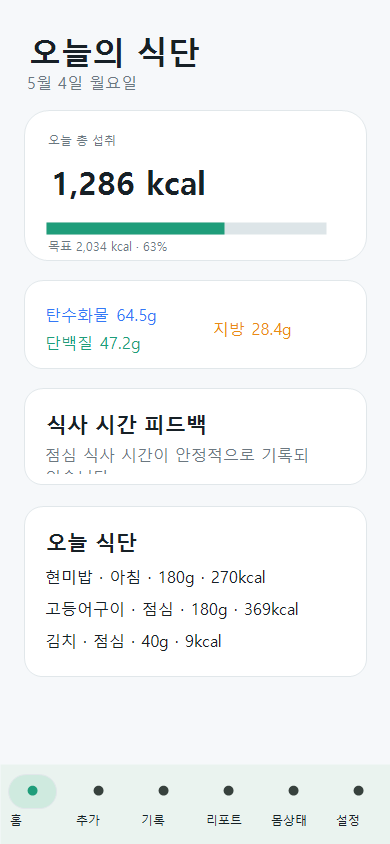
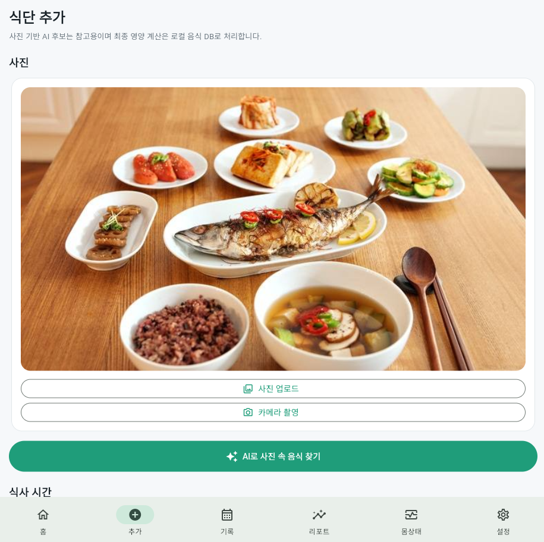
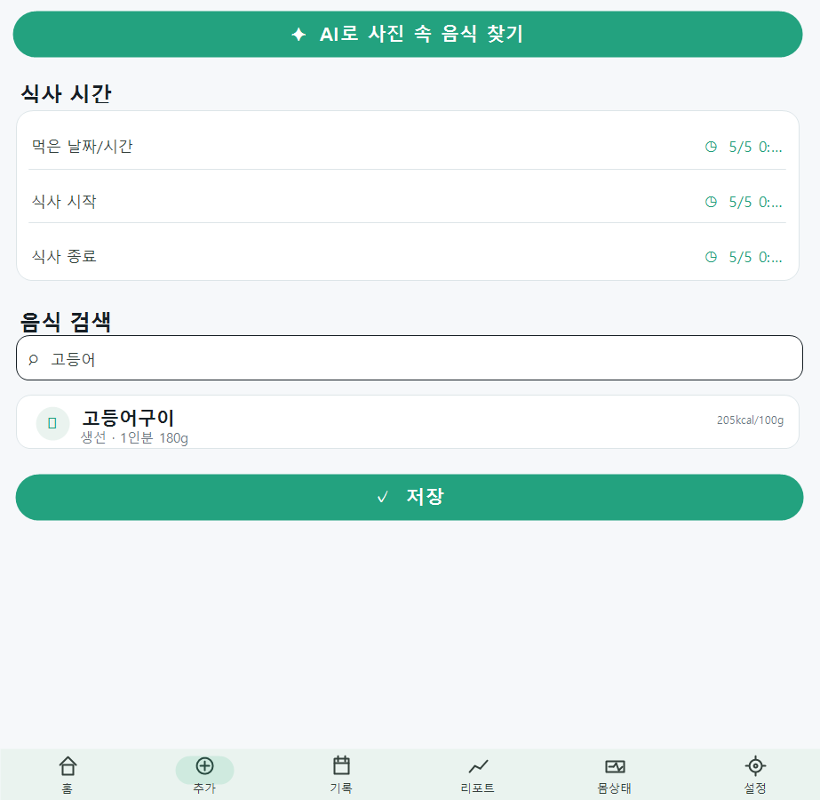
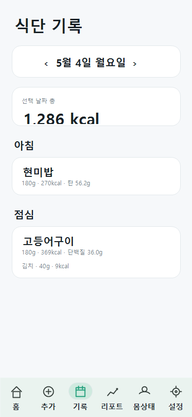
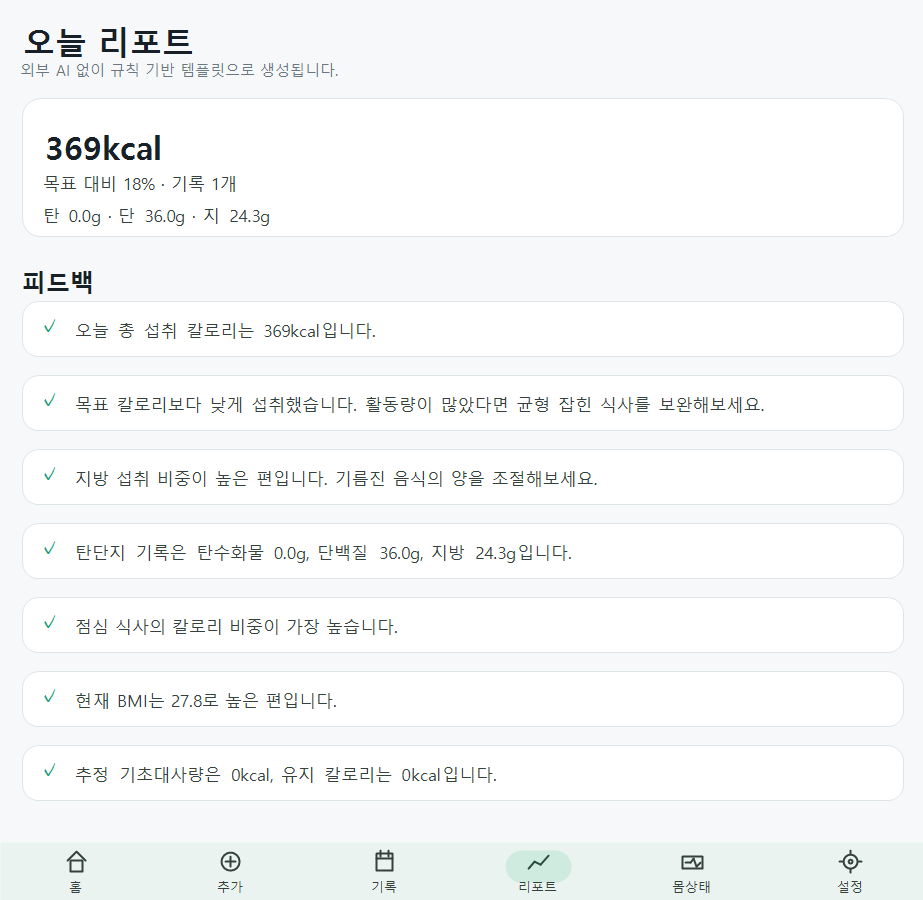
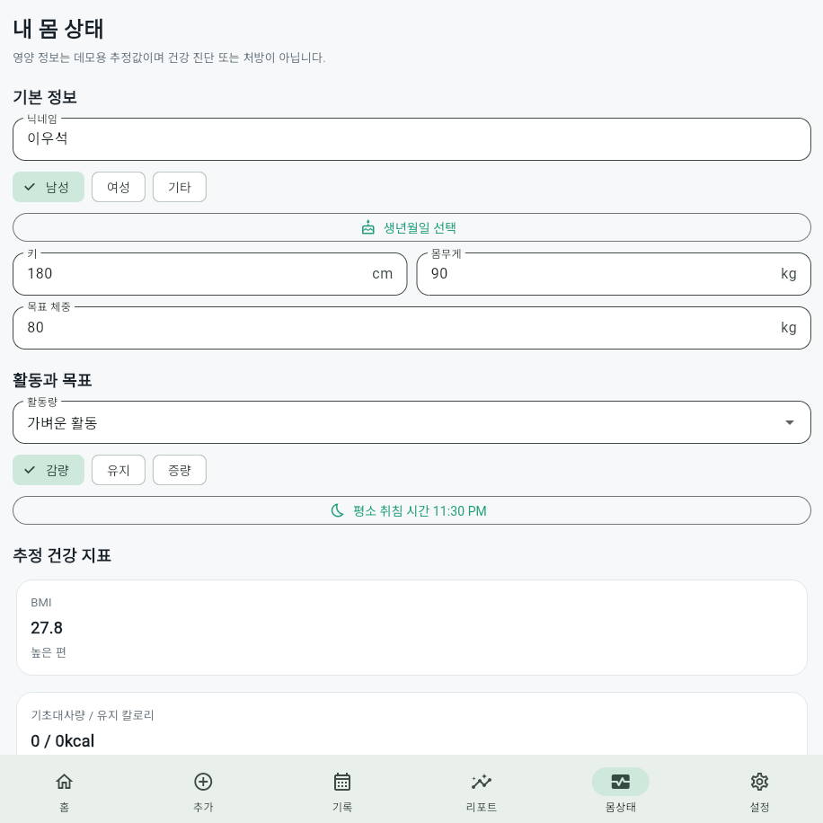
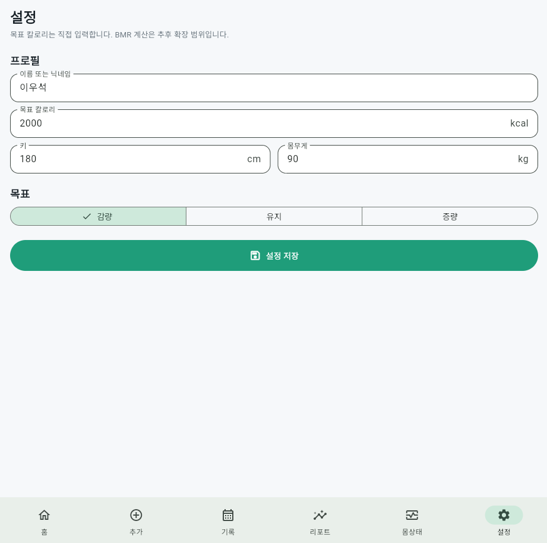

# 오늘의 식단

> 사진 기반 AI 음식 후보, 식단 기록, 개인 건강 지표, 식사 시간 피드백을 결합한 Flutter 포트폴리오 앱

오늘의 식단은 음식 사진을 업로드하고, AI 후보 추정 흐름을 통해 식단을 기록하는 모바일/Web 앱 MVP입니다.  
현재 버전은 실제 유료 VLM API를 호출하지 않고 `MockVisionFoodService`로 AI 분석 UX를 구현했습니다. 칼로리와 탄단지는 AI가 확정하지 않으며, 로컬 음식 DB와 사용자가 확인한 섭취량을 기준으로 앱 내부에서 계산합니다.

## 주요 기능

- 음식 사진 업로드 및 카메라 촬영
- Mock AI 기반 음식 후보 표시
- 음식 후보 체크/해제 및 섭취량 조정
- 로컬 음식 DB 기반 칼로리/탄수화물/단백질/지방 계산
- 오늘 식단 대시보드
- 날짜별 식단 기록 및 삭제
- 규칙 기반 식단 리포트
- 개인 건강 프로필 관리
- BMI, BMR, TDEE, 목표 칼로리 계산
- 식사 시작/종료 시간 기록
- 식사 시간 패턴 피드백
- Supabase 연동 준비 및 RLS SQL 포함
- Flutter Web 데모 및 Android APK 빌드 구조

## 화면 미리보기

| 홈 | 추가: 사진 | 추가: 저장 |
| --- | --- | --- |
|  |  |  |

| 기록 | 리포트 | 몸상태 |
| --- | --- | --- |
|  |  |  |

| 설정 |
| --- |
|  |

## 기술 스택

- Flutter
- Dart
- Material 3
- shared_preferences
- image_picker
- supabase_flutter
- Supabase PostgreSQL, RLS 설계
- Vercel 배포 구조

## 앱 구조

```text
lib/
  core/
    constants/
    utils/
      nutrition_calculator.dart
      health_calculator.dart
      meal_timing_analyzer.dart
      report_generator.dart
  data/
    local/
    remote/
    models/
    repositories/
  presentation/
    screens/
      home/
      add_meal/
      records/
      report/
      health/
      settings/
    widgets/
  services/
    vision_food_service.dart

assets/
  data/food_db_kr_sample.json

supabase/
  schema.sql
```

## 화면 구성

| 화면 | 설명 |
| --- | --- |
| 홈 | 오늘 섭취 칼로리, 목표 대비 진행률, 탄단지, BMI/BMR 요약, 식사 시간 피드백 |
| 추가 | 사진 업로드, Mock AI 음식 후보, 음식 검색, 섭취량 선택, 식사 시간 입력 |
| 기록 | 날짜별 식단 기록, 식사 유형별 그룹, 기록 삭제 |
| 리포트 | 칼로리, 탄단지, 식사 시간, BMI, 목표 칼로리 기반 규칙 리포트 |
| 몸상태 | 닉네임, 성별, 생년월일, 키/몸무게, 활동량, 목표, 취침 시간 관리 |
| 설정 | 기본 목표 칼로리 및 사용자 설정 |

## AI/VLM 설계

현재 앱은 실제 OpenAI, Gemini, Claude API를 호출하지 않습니다.

```text
현재 구조
Flutter App
→ MockVisionFoodService
→ 데모 음식 후보 반환
→ 로컬 FoodItem DB 매칭
→ 사용자가 섭취량 확인
→ 앱 내부 계산
```

추후 실제 VLM을 붙일 때는 Flutter 앱에 API Key를 넣지 않고 서버 측에서만 호출해야 합니다.

```text
권장 확장 구조
Flutter App
→ Vercel API Route 또는 Supabase Edge Function
→ OpenAI/Gemini VLM API
→ JSON 응답
→ Flutter App 표시
```

실제 연결 수정 위치:

```text
lib/services/vision_food_service.dart
```

## 건강 계산 공식

BMI:

```text
weightKg / (heightMeter * heightMeter)
```

BMR, Mifflin-St Jeor:

```text
male   = 10 * weightKg + 6.25 * heightCm - 5 * age + 5
female = 10 * weightKg + 6.25 * heightCm - 5 * age - 161
```

TDEE:

```text
BMR * activityFactor
```

목표 칼로리:

```text
loss     = TDEE - 400
maintain = TDEE
gain     = TDEE + 300
```

모든 결과는 건강 진단이나 처방이 아닌 식단 기록 참고용 추정 결과입니다.

## Supabase 설정

Supabase SQL editor에서 아래 파일을 실행합니다.

```text
supabase/schema.sql
```

포함된 테이블:

- profiles
- weight_logs
- meal_logs
- meal_items
- daily_summaries
- ai_analysis_logs

모든 개인 데이터 테이블은 RLS를 전제로 설계되어 있으며, `user_id = auth.uid()`인 데이터만 접근하도록 정책을 포함했습니다.

Flutter 실행 시 Supabase URL과 anon key는 코드에 하드코딩하지 않고 `--dart-define`으로 전달합니다.

```powershell
flutter run -d chrome `
  --dart-define=SUPABASE_URL=https://your-project.supabase.co `
  --dart-define=SUPABASE_ANON_KEY=your-public-anon-key
```

서비스 role key, OpenAI/Gemini/Claude API key는 Flutter 앱에 넣지 않습니다.

## 실행 방법

패키지 설치:

```powershell
flutter pub get
```

Chrome Web 실행:

```powershell
flutter run -d chrome
```

Windows 빠른 실행:

```powershell
.\run_web.bat
```

## Android APK 빌드

```powershell
flutter build apk --release
```

빌드 결과:

```text
build/app/outputs/flutter-apk/app-release.apk
```

## Web 빌드 및 Vercel 배포

```powershell
flutter build web --release
```

Vercel CLI 배포:

```powershell
cd build/web
npx vercel --prod
```

## 포트폴리오 포인트

- 단순 CRUD 앱이 아니라 식단 기록, 건강 지표, 생활 패턴 피드백을 하나의 흐름으로 연결
- 실제 AI 비용 없이 AI 기반 UX를 Mock 서비스로 먼저 구현
- 추후 VLM, Supabase, Edge Function으로 확장 가능한 계층 구조
- Web, Android, iOS 구조를 모두 유지
- 의료/처방 앱이 아닌 참고용 건강 관리 앱으로 안전한 문구와 책임 범위 명시

## 주의 사항

- 현재 AI 음식 분석은 Mock 데이터입니다.
- 칼로리와 영양 정보는 데모용 추정 샘플입니다.
- 리포트는 외부 AI가 아닌 규칙 기반으로 생성됩니다.
- 의료 진단, 처방, 치료 목적의 앱이 아닙니다.
